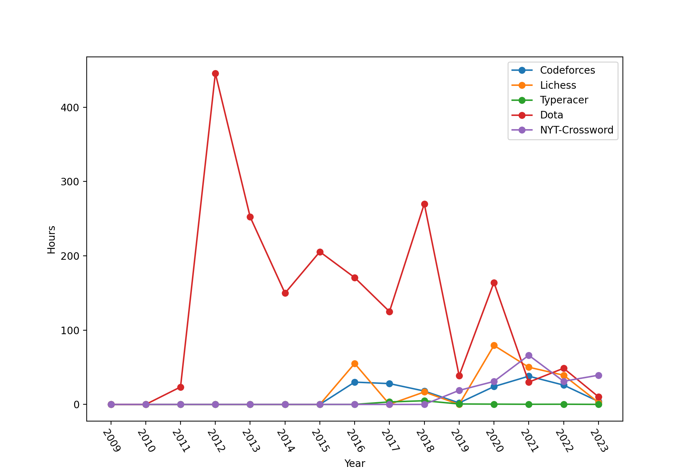

# data-fetishism
Wikipedia says:
> The quantified self refers both to the cultural phenomenon of self-tracking with technology and to a community of users and makers of self-tracking tools who share an interest in "self-knowledge through numbers".[1]

This repo will attempt to collect personal data from various sources and expose common interfaces. 

1. scripts for collecting data, e.g. from web apis
2. storage of the data, in their raw form and/or common form
3. tools to analyze and visualize data

WIP

Here's an example of what it can do so far!



# timed data

```
{
    timestamp: timestamp,

}
```
